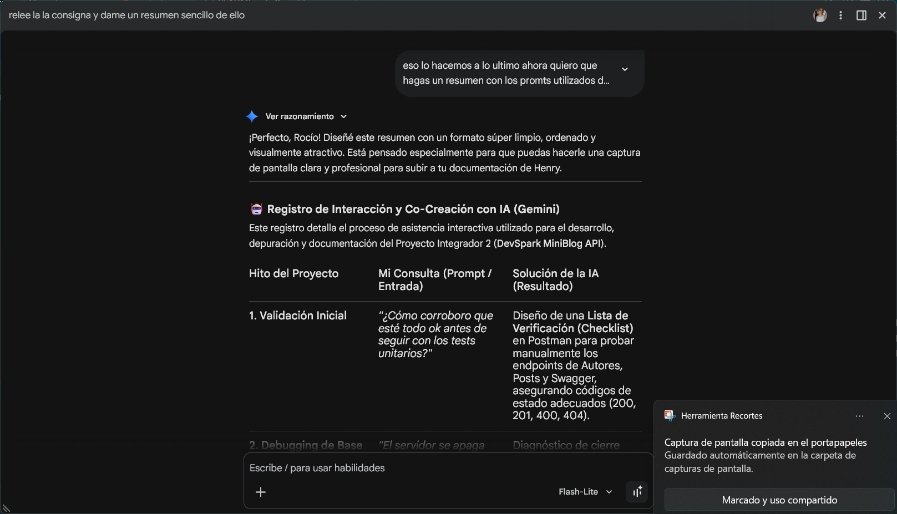
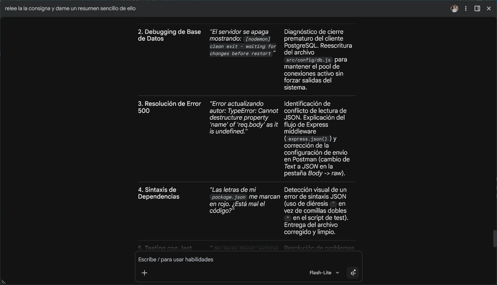
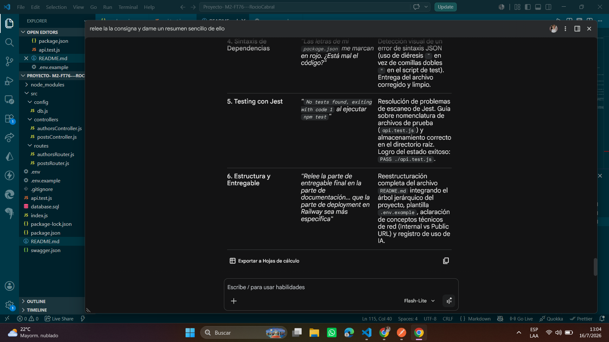
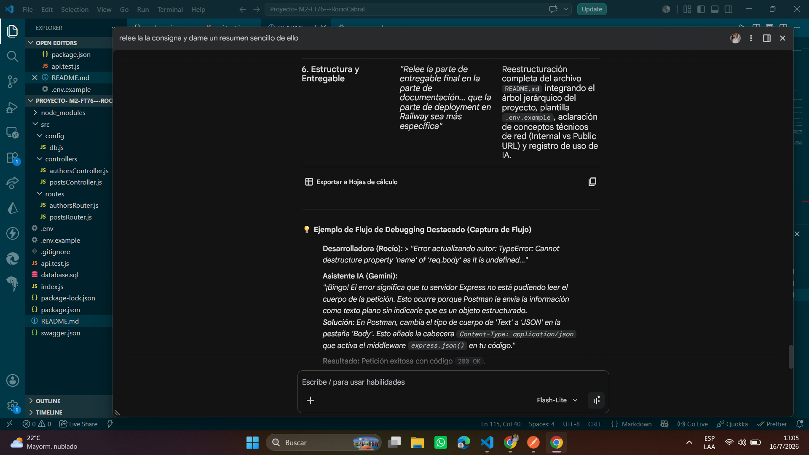

# 🚀 MiniBlog API - DevSpark

Este proyecto es una API RESTful construida para la startup **DevSpark**, desarrollada como Proyecto Integrador para el Módulo 2 del Bootcamp de Soy Henry.

## 🛠️ Tecnologías Utilizadas
* **Backend:** Node.js, Express.js
* **Base de Datos:** PostgreSQL, paquete `pg`
* **Documentación:** Swagger (OpenAPI)
* **Testing:** Jest, Supertest

## 📂 Estructura del Proyecto
```text
proyecto--m2-ft76---rociocabral/
├── assets/               # Capturas de pantalla de soporte (Registro IA)
├── node_modules/         # Carpeta autogenerada con las dependencias
├── src/
│   ├── config/
│   │   └── db.js         # Configuración y conexión a PostgreSQL
│   ├── controllers/
│   │   ├── authorsController.js
│   │   └── postsController.js
│   └── routes/
│       ├── authorsRouter.js
│       └── postsRouter.js
├── .env                  # Variables de entorno privadas (no se sube a GitHub)
├── .env.example          # Plantilla de variables de entorno para el equipo
├── .gitignore            # Archivo para evitar subir node_modules y .env
├── api.test.js           # Test unitario básico con Jest
├── database.sql          # Script de creación de tablas y datos semilla
├── index.js              # Servidor Express principal
├── package.json          # Configuración del proyecto, scripts y dependencias
├── README.md             # Documentación oficial del proyecto
└── swagger.json          # Archivo de especificación OpenAPI

⚙️ Instalación y Configuración Local
1. Clonar el repositorio:

Bash
git clone <URL_DE_TU_REPOSITORIO>


2. Instalar las dependencias:

Bash
npm install


3. Configurar las variables de entorno:
Crea un archivo .env en la raíz con la siguiente estructura:

Fragmento de código
PORT=3000
DB_USER=tu_usuario_postgres
DB_HOST=localhost
DB_PASSWORD=tu_contraseña
DB_NAME=tu_base_de_datos
DB_PORT=5432


4. Ejecutar el script de la base de datos:
Ejecuta el archivo database.sql en tu pgAdmin o terminal para crear las tablas y datos semilla.

5. Iniciar el servidor en modo desarrollo:

Bash
npm run dev


📚 Documentación de la API
Una vez que el servidor esté corriendo, puedes acceder a la interfaz gráfica de la documentación generada con Swagger ingresando a:
👉 http://localhost:3000/api-docs


🧪 Pruebas Unitarias
El proyecto cuenta con testing automatizado para verificar la disponibilidad del servidor. Para correr los tests, ejecuta:

Bash
npm test


☁️ Guía Paso a Paso para el Deployment (Despliegue en Railway)
Subir este proyecto a internet es muy sencillo usando la plataforma gratuita Railway.

Crear DB: Inicia sesión en Railway, haz clic en "New Project" -> "Provision PostgreSQL".

Subir Código: Haz clic en "+" (New) -> "GitHub Repo" y selecciona tu repositorio.

Variables: En los ajustes de tu servicio web en Railway, ve a la pestaña "Variables" y agrega las variables (DB_USER, DB_HOST, etc.) copiando los valores desde tu base de datos de Railway.

Networking: Para obtener el link público, ve a la pestaña "Networking" del servicio web y haz clic en "Generate Domain".


 
## 🤖 Registro del Uso de AI en el Proyecto







Durante el desarrollo de este Proyecto Integrador, se utilizó Inteligencia Artificial (Gemini) como asistente técnico para:

Resolución de errores de sintaxis y debugging (Ej: Errores 500 por mal formato de JSON).

Explicación de conceptos teóricos sobre la configuración del pool de conexiones de PostgreSQL.

Generación de la estructura base para la documentación de Swagger (swagger.json).

Estructuración del archivo final README.md para cumplir con las rúbricas de entrega.


👩‍💻 Desarrollado por: Rocío Cabral - Estudiante de Soy Henry